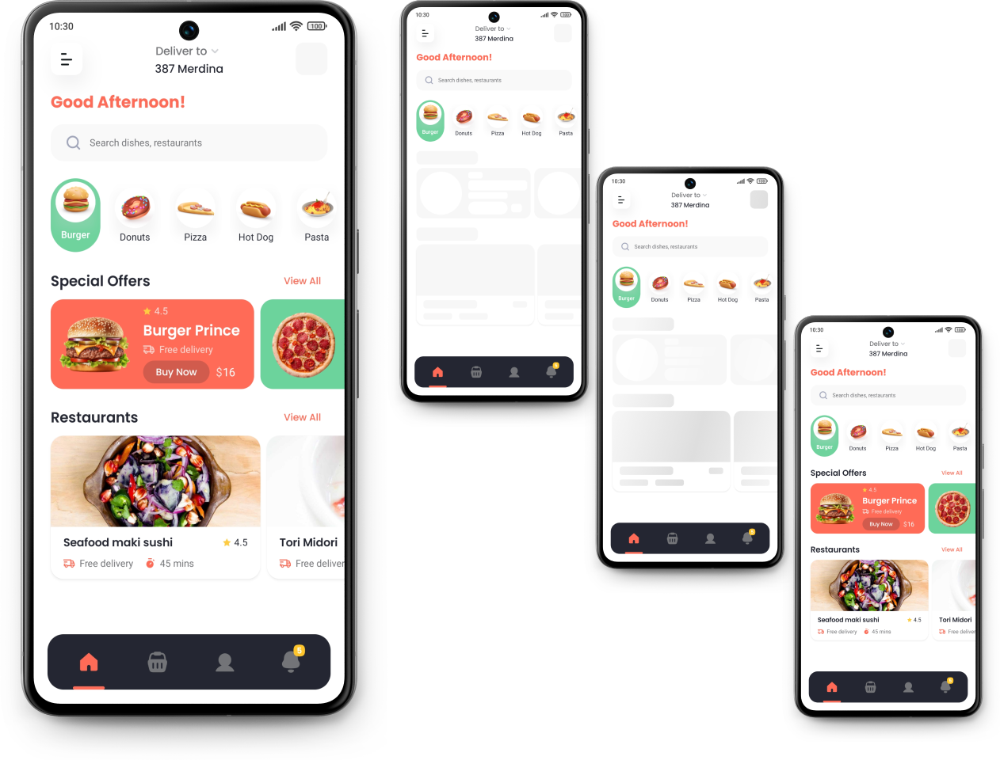
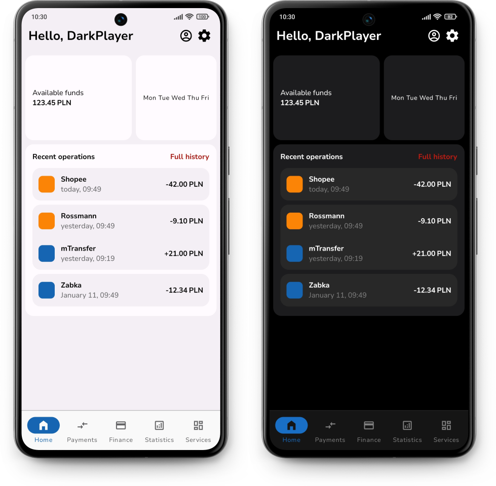

composed
========

Android JetpackCompose implementations for various apps

## Demo Apps

### Comida - Food Delivery App

- [`demos/comida-app`](demos/comida-app/src/main/kotlin/dev/tonycode/composed/comida/ui/ComidaAppActivity.kt)
- design by Ola Hamdy - [dribbble](https://dribbble.com/shots/23157137-Comida-Food-Delivery-App-UI-Kit)

### mBank - Redesigned App

- [`demos/mbank-app`](demos/mbank-app/src/main/kotlin/dev/tonycode/composed/mbank/ui/MbankAppActivity.kt)
- design by DarkPlayer - [figma](https://www.figma.com/community/file/1189539388777252188)

## License

[MIT](LICENSE)
